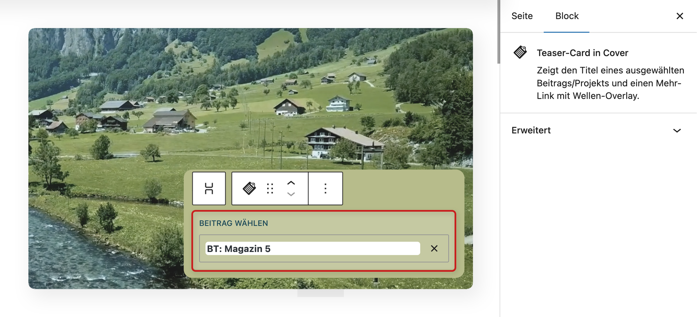
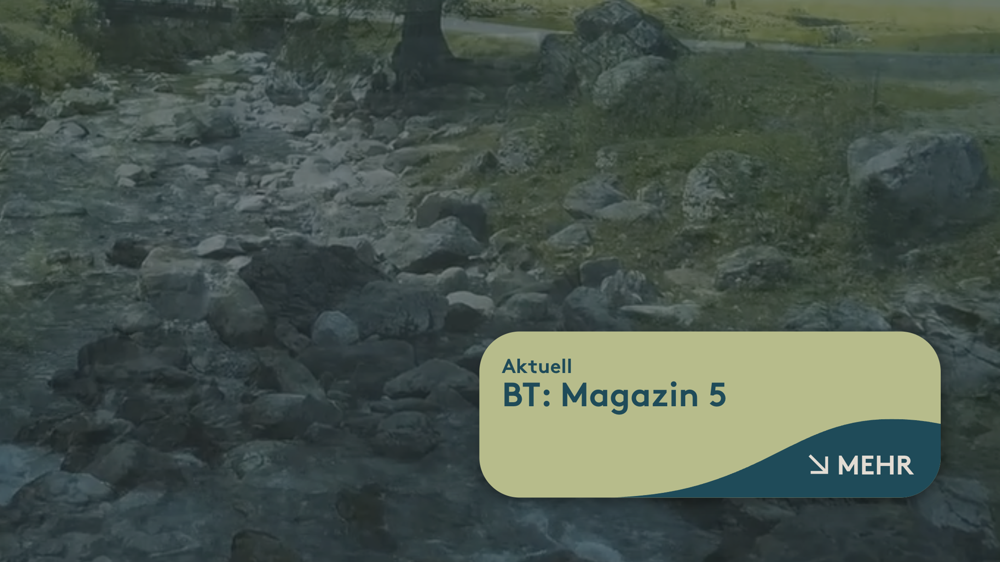

# UD Block: Teaser-Card in Cover

Ein Block zur Darstellung eines Beitrags oder Projekts als **Teaser innerhalb eines Cover-Blocks**.
Er zeigt den Titel und einen „Mehr“-Link – ideal für Startseiten, Einstiegssektionen oder visuell betonte Inhaltsbereiche.

---

## Funktionen

- Verlinkt automatisch auf einen ausgewählten Beitrag oder ein Projekt (`postId`)
- Darstellung des Beitragstitels innerhalb eines Cover-Blocks mit "Mehr erfahren"-Link
- Dynamisches serverseitiges Rendering (`render.php`)
- Kompatibel mit Full Site Editing (FSE)
- Unterstützt Anker (`supports.anchor: true`) für Direktverlinkungen
- Kompatibel mit Core-Cover-Blöcken und flexiblen Layouts

---

## Editor-Ansicht

*Abbildung: Auswahl eines Beitrags im Gutenberg-Editor.*

---

## Frontend-Ansicht

*Abbildung: Ansicht im Frontend eines Teasers.*

---

## Technische Details

- Entwickelt mit [`@wordpress/scripts`](https://developer.wordpress.org/block-editor/reference-guides/packages/packages-scripts/)
- Zentrale Attribute:
    - `postId` *(number)* – ID des ausgewählten Beitrags oder Projekts
    - PHP-Rendering greift auf den gewählten Post zu und gibt Titel + Link aus.

---

## Installation

1. Plugin-Ordner `ud-teaser-card-in-cover` in `wp-content/plugins/` kopieren
2. Im WordPress-Backend unter **Plugins → Installierte Plugins** aktivieren
3. Im Editor den Block **„UD Teaser-Card in Cover“** einfügen
4. Beitrag oder Projekt auswählen und optional den Text anpassen

---

## Anforderungen

- WordPress ≥ 6.7
- PHP ≥ 7.4
- Aktiver Block-Editor (Gutenberg oder FSE-kompatibles Theme)

---

## Autor

**ulrich.digital gmbh**
[https://ulrich.digital](https://ulrich.digital)

---

## Lizenz

GPL v2 or later
[https://www.gnu.org/licenses/gpl-2.0.html](https://www.gnu.org/licenses/gpl-2.0.html)
